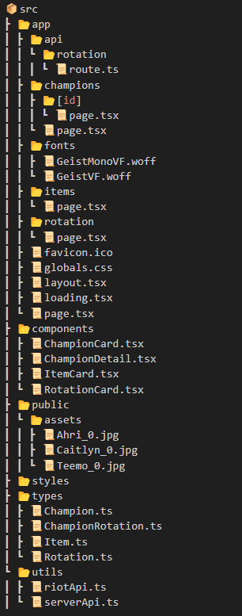
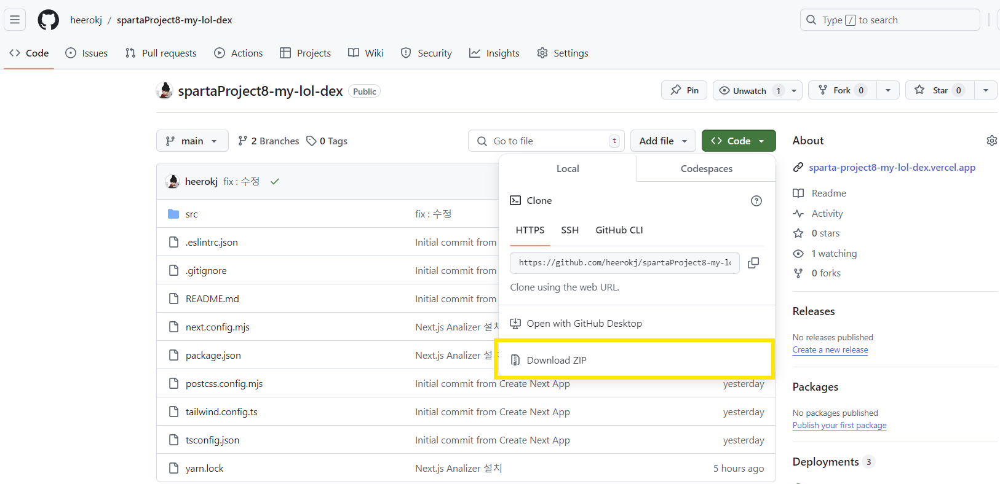
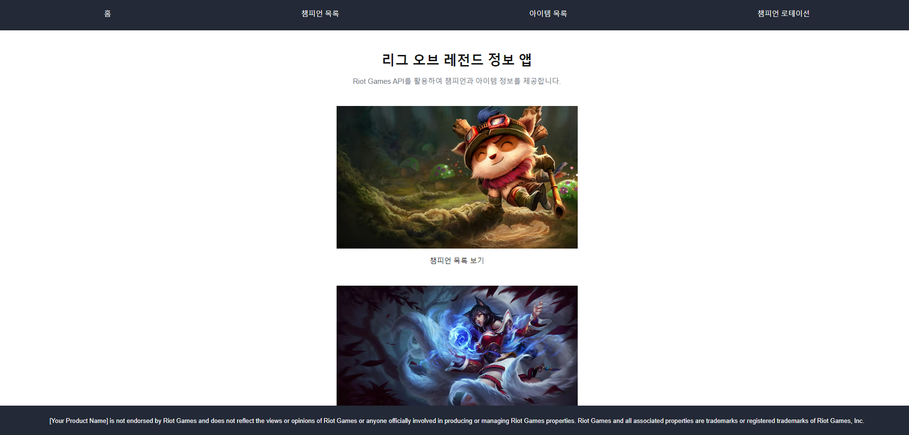
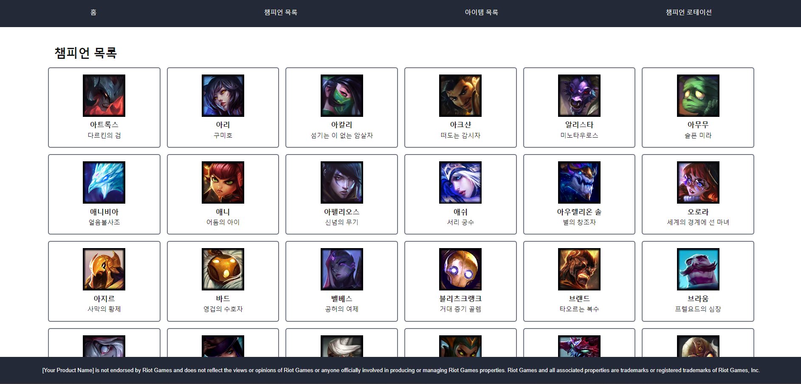
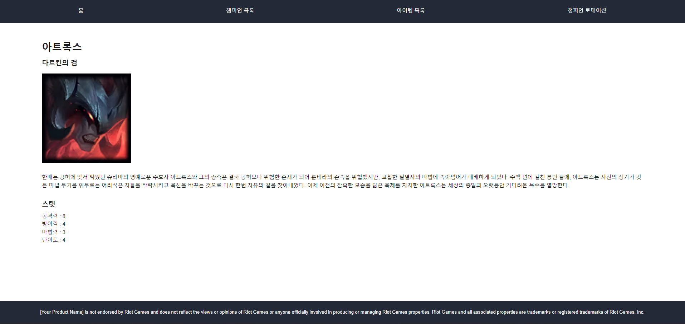
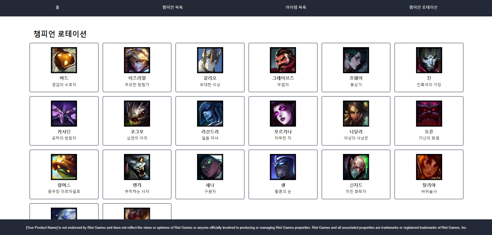

## my-lol-dex

NextJS와 TypeScript를 사용하여 Riot API를 활용한 리그 오브 레전드 정보 앱 만들기

배포 링크 : [`sparta-project8-my-lol-dex.vercel.app`](https://sparta-project8-my-lol-dex.vercel.app)

<br/>
깃허브 링크 : [`https://github.com/heerokj/spartaProject8-my-lol-dex.git`](https://github.com/heerokj/spartaProject8-my-lol-dex.git)
<br/>
<br/>

## 파일 구조


<br/>
<br/>

## 사용 기술

[](https://github.com/msdio/stackticon)

<br/>
<br/>

## 프로젝트 설치 및 실행 방법

1. 코드 다운로드 받기<br/>
   해당 리포지토리 메인 페이지에서 <>Code 버튼 클릭 후 맨 밑의 Download ZIP를 눌러 다운로드 합니다.
   

2. 다운로드 받은 코드 추가하기<br/>
   VScode를 실행시킨 후 File -> Open Folder -> 다운받은 폴더를 열어줍니다.

3. 프로젝트 실행시키기<br/>
   작업 영역에 추가한 프로젝트를 확인하고, 터미널에서 해당 프로젝트 위치로 들어가 npm start 또는 yarn dev 명령어를 입력한 후 실행시킵니다. 해당 포트번호로 실행시킵니다.<br/>
   🚨 실행하기 전, npm 또는 yarn을 설치가 선행으로 이뤄줘야 합니다.

```bash
npm start
# or
yarn dev
```

<br/>
<br/>

## 주요 기능

1. 홈 페이지<br/>
   
   <br/>
   화면의 이미지를 클릭하면 챔피언 목록 페이지, 아이템 목록 페이지, 챔피언 로테이션 페이지로 이동합니다. 또한 네비게이션 바를 통해서도 페이지 이동이 가능합니다. <br/>

2. 챔피언 목록 페이지<br/>
   
   <br/>
   롤 챔피언 전체 목록을 볼 수 있습니다.<br/>

3. 챔피언 상세 페이지<br/>
   
   <br/>
   챔피언 목록 페이지에서 챔피언을 클릭하면 챔피언 상세내용을 볼 수 있습니다.<br/>

4. 챔피언 로테이션 페이지<br/>
   
   <br/>
   챔피언 로테이션 목록을 볼 수 있습니다. 챔피언을 클릭하면 해당 챔피언의 상세 내용을 볼 수 있는 페이지로 이동합니다.
   <br/>
